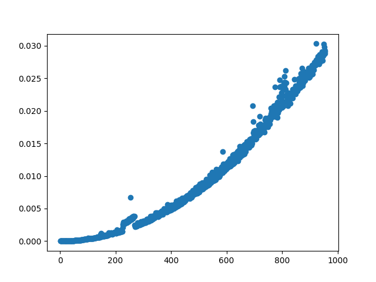

# Introducció

Aquesta pràctica té com a objectiu la creació d'un programa, que utilitzant una sèrie de mostres dels Nucleotids relacionades amb el COVID-19 en cada país, agafa les mostres representatives de cada país, i sobre aquestes, fa les alineacions i comparacions necessàries per a relacionar-les i agrupar-les per similaritat entre elles.

# Main

Aquesta serà la funció principal del programa i tindrà com a objectiu la recollida d'arguments i la execució de la funcionalitat principal.

Els arguments acceptats són el següents:

+ -c "fitxer" : introdueix la localització del fitxer .csv que conté les mostres de les dades

# Preprocessament

## Tractament de les seqüències del fitxer csv

### Pseudocodi

    function preprocess(csvpath):
        country_dictionary <- {}
        csvfile <- open file csvpath
        for row in csvfile:
            if all necessary data is not empty:
                values_tuples <- (get Accession,Release_Date and Length data)
                Geo_location <- get Country of row
                country_dictionary[Geo_Location] <- add values_tuples

        close file csvfile  
        medians_list <- []
        for country in all countries:
            sort country_dictionary[country] by Length data
            median_sample <- get country data located at the length based median location
            medians_list <- add median sample data
        return medians_list

### Cost teòric

Cost O(n(m+k)), on

+ n = number of lines in csv file,
+ m = number of keys in country_dictionay
+ k = length of string

## Obtenció de la mostra de longitud mediana d’un país 

Vam escollir aquest algoritme per que se’ns va demanar implementar un algorisme de càlcul de mediana utilitzant dividir i vèncer i vam veure que aquest complia els requisits.

### Pseudocodi

    function get_median(country samples list, position) is
        sublist <- divide country samples list in sublists of 5 samples
        medians <- list of sublists medians
        if number of medians <= 5:
            pivot <- median of medians
        else:
            pivot <- recursive get_median(medians, median of medians)

        low <- elements lower or equal than pivot
        remove last element from low
        high <- elements higher than pivot

        k <- number of elements of low
        if position < k:
            return recursive get_median(low, position)
        elif position > k:
            return recursive get_median(high, position-k-1)
        else:
            return pivot

### Cost teòric

Cost O(n), on 
+ n és el nombre d'elements d'un país

## Obtenció de seqüències Fasta

### Pseudocodi

    function get_fasta_sequences(sample_list):
        for sample in sample_list:
            obtain fasta sequence of sample via HTTP
            if not response:
                ask user if continue or not
            split data by new line
            all subsequences of fasta sequence
            assign fasta sequence to sample

### Cost teòric

El cost teòric és d'ordre O(n(m+k)) tal que

+ n és el numero de mostres que hi ha a sample_list.
+ m és el temps d'obtenció de la seqüencia via HTTP.
+ k és numero de subseqüències que formen la seqüencia fasta.

# Alineament de seqüències

## Anàlisis dels algorismes existents

Pel que fa a l'alineament de seqüències s'han trobat els següents algorismes:

1. Algorisme de Needleman-Wunsch
    + Aquest algorisme utilitza programació dinàmica per a buscar un alineament "global" entre dues seqüències.
    Aquest algorisme utilitza ordre O(nm), ja que crea una matriu per a emmagatzemar les puntuacions dels diferents possibles alineaments a efectuar, i en finalitzar trobarà l'alineament òptim.
2. Algorisme de Smith-Waterman
    + Aquest algorisme utilitza una versió similar al de Needleman-Wunsch però aquest té com a objectiu buscar un alineament "local" entre dues seqüències.
    De totes maneres l'ordre serà de O(nm) per la mateixa raó que el mètode de Needleman-Wunsch, l'única diferència serà en el moment d'efectuar l'alineació un cop es té la matriu de les puntuacions parcials, on es començarà el procés des d'una posició diferent.
3. Algorisme de Hirschberg
    + Aquest algorisme també és una modificació basada en l'algorisme de Needleman-Wunsch, encara que manté l'ordre d'O(nm), millora la utilització de l'espai per part de les matrius.

En el nostre cas s'ha elegit l'algorisme de Needleman-Wunsch per les següents raons:

1. El cost teòric era el mateix en tots els algorismes utilitzats i per tant, pel que fa a aquesta característica la diferenciació entre els algorismes era irrellevant.

2. Encara que és cert alguns dels algorismes proporcionats tenen menor temps d'execució, al ser una diferència bastant petita, s'ha considerat innecessari preocupar-se'n.

3. La simplicitat d'efectuar l'algorisme també ha sigut una raó molt important en la seva selecció.

### Pseudocodi de l'algorisme seleccionat

Primerament s'ha de mencionar que teoricament l'algorisme s'inicia amb una matriu amb els costs de totes les transformacions possibles amb les dades de la seqüència, però nosaltres hem utilitzat uns costos tal que no necessitem d’aquesta matriu. Si no s’ha de fer cap transofrmació, llavors el cost és 0, si n’ha de fer una, llavors el cost puja a 1.

A més a més també s'ha d'afegir una penalització de gap.

Un cop fet es crearà una matriu amb les respostes parcials de la següent manera:

    int F[Longitud A][Longitud B]

    for i in range(0,Longitud A):
        F[i][0]=i*penalització de gap

    for j in range(0,Longitud B):
        F[0][j]=j*penalització de gap

    for i in range(1,Longitud A):
        for j in range(1,Longitud B):
            int Opcio1=F[i-1][j-1]+Cost transformació entre les lletres.
            int Opcio2=F[i-1][j]+penalització de gap
            int Opcio3=F[i][j-1]+penalització de gap
        F[i][j]=max(Opcio1,Opcio2,Opcio3)

Un cop tenim la matriu, la puntuació de similitud de la millor alineació serà la puntuació que es troba en la posició F[longitudA][longitudB].

També existeix una segona part de l'algorisme que tindria com a objectiu crear dos strings assenyalant com quedarien els strings un cop efectuada l'alineació òptima.  Com que en el nostre cas únicament volem saber la puntuació de l'alineament, aquesta segona part no l'hem efectuat.

### Anàlisis Teòric

Per a la implementació s'ha trobat el següent problema:

Com que les mostres a comprovar eren molt grans (29000 aprox.), el temps per a executar l'algorisme en Python era inacceptable.

Per a solucionar-lo s'havien proposat les següents accions:

1. Reduir la mida de la mostra a comprovar i únicament alinear els primers 1000 caràcters.

2. Intentar efectuar l'algorisme millorant Python amb llenguatges més ràpids com serien Rust, Haskell, C, C++, etc.

En el nostre cas s'ha decidit efectuar l’algorisme estenent el nostre script de Python amb un programa de C el qual s’en encarregaria de fer l’alineació entre dos seqüències. Aquest canvi redueix el temps d’alineació entre dos seqüències de 29000 caràcters a 3.7 segons aprox. Encara així, per alinear totes les mostres amb tota la resta, l’execució pot arribar a durar fins a 21 minuts. Degut això, es pot reduir la mida de les seqüències alineades, fent així que el temps d’alineació sigui casi imperceptible.

Depenent del sistema de puntuació utilitzat el temps d’execució varia. Nosaltres hem escollit el que creiem que és el sistema de puntuació menys intrusiu en el runtime.

Com hem dit anteriorment, el cost teòric serà O(nm), on

+ n = llargada seqüència 1
+ m = llargada seqüència 2

### Anàlisis Experimental

Primer de tot s'ha de mencionar que la validesa el grafic proporcionat també depen parcialment de la situació de l'ordinador en el moment de la seva creació i per tant, la seva veracitat es mes qüestionable.

Per a capturar les dades s'ha decidit comparar una seqüencia amb si mateixa utilitzant diferentes llargades.

Com es pot comprovar, aquesta grafica s'aproxima al cost teoric "quadratic" mencionat anteriorment.

## Classificació

Per a la classificació que es van proposar son els següents:
1. Hierarchical Agglomerative Clustering 
    + Aquest algoritme crea una estructura en forma d'arbre mitjançant l'agrupament de clústers que contenen elements pròxims entre ells.
    Això es farà de la següent manera:
        + Primerament es crearà un cluster per cada dada a agrupar.
        + Seguidament es crearà un nou cluster mitjançant l'agrupament de dos clústers pròxims entre ells.
        + Aquest últim es repetirà fins que ens quedi un únic clúster.
    
    + Un cop finalitzat es tindrà una estructura jeràrquica de clústers.
2. k-medoids
    + Aquest algoritme té com a objectiu la divisió del set de dades en k clusters que continguin dades, que seran properes a una dada establerta com a "Centre" de cada clúster.
    Aquest algoritme tindrà el següent funcionament:
        + Primerament es seleccionen k centres aleatoris.

        + Seguidament es seleccionen els diferents elements que pertanyen a cada clúster basant-se en la distància amb el centre d'aquest.

        + Es selecciona nous centres dels diferents clústers basant-se en la suma de cada punt amb la resta. El centre serà el que tingui la suma mínima.

        + Per últim es repetirà el procés a partir del segon pas fins que no tinguem més canvis de centres.
    
    + Un cop finalitzat l'algoritme es disposaran dels diferents clústers amb els seus elements corresponents.

En el nostre cas s'ha elegit l'algoritme de k-medoids per la següent raó:

1. Ens ha semblat un algorisme amb una fàcil implementació i una utilitat que concordava correctament amb l'objectiu de la pràctica.

### Pseudocodi de l'algoritme seleccionat

    function clusters(centers(Initial:Chosen Randomly), clusters(Initial:[]), values):
        new_clusters=cluster for each center in centers
        for element in range from 0 to len(values):
            add to element to closest center distance new_cluster
        new_centers=calculate_new_centers of new_clusters
        if new_centers==centers:
            return clusters
        else:
            return clusters(new_centers,new_clusters,values)

### Anàlisis Teoric
Per al cost d'aquest algoritme tenim el següent problema:
El pitjor cas es molt complicat de calcular ja que a primera vista no es pot saber quin número de crides es necessitaran per a estabilitzar els centres.

Per tant, tal i com s'ha mencionat en les classes de teoria farem la assumpció de que tindrà l'ordre de O(n/k), on
+ n = nombre de mostres.
+ k = nombre de clústers.

### Anàlisis Experimental

