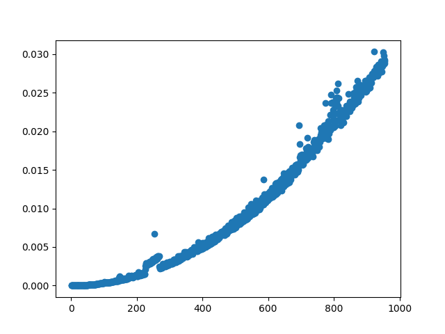
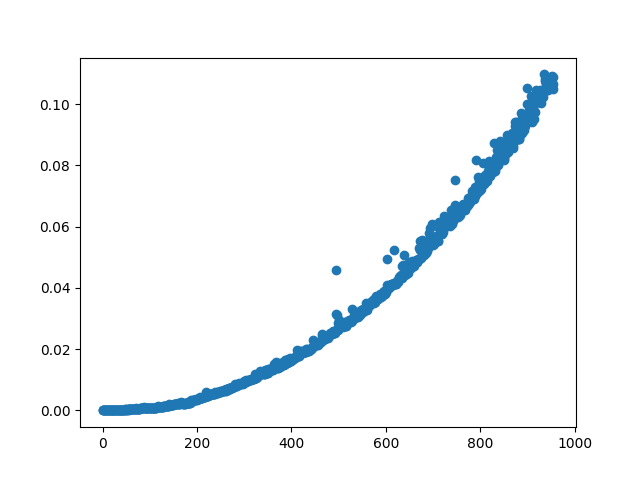
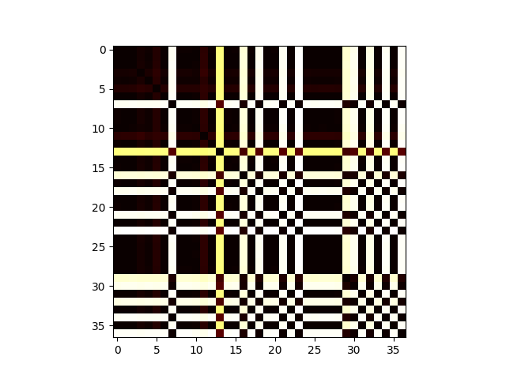
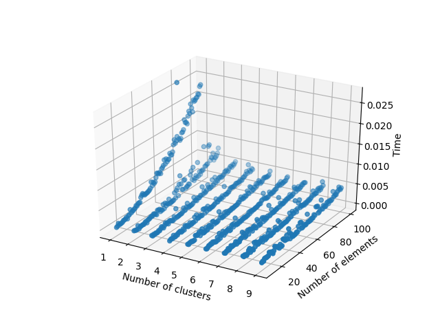

# Pràctica algorítmica

### Autors
Guillem Camats Felip, Adrià Juvé Sánchez, Martí La Rosa Ramos, Xavier Nadal Reales

### Data d'entrega
25 de maig de 2020

### Professor
Jordi Planes Cid

### Assignatura
Algrítmica i complexitat

# Introducció

Aquesta pràctica té com a objectiu analitzar i comparar diferents mostres de Nucleòtids relacionades amb el SARS-CoV-2. Per començar, s'elegeix una mostra representativa de cada país. Aquestes, les comparem, puntuem i agrupem, bastant-nos en la seva similitud. Opcionalment, es mostra la representació gràfica d'aquesta representació.

# Requisits

Per a executar el nostre programa es necessitaran les següents llibreries:

- networkx
- matplotlib

Tot i que no és necessari per a executar el programa,
s'ha creat un fitxer Makefile per a compilat els mòduls de C.
Per a compilar el codi en Rust: $cd alignment_rust, $cargo build --release

# Main

Aquesta serà la funció principal del programa i tindrà com a objectiu la recollida d'arguments i l'execució de la funcionalitat principal.

Els arguments acceptats són els següents:

- -c "fitxer" : introdueix la localització del fitxer .csv que conté les mostres de les dades.
- -r: Execució del programa utilitzant la implementació en Rust.
- -g: Mostra la informació resultant dels clústers en format de graf.

# Preprocessament

## Tractament de les seqüències del fitxer csv

### Pseudocodi

    function get_samples_of_median_length_by_country(csvpath):
        country_dictionary <- {}
        csvfile <- open file csvpath
        for row in csvfile:
            if all necessary data is not empty:
                values_tuples <- (get Accession,Release_Date and Length data)
                geo_location <- get Country of row
                country_dictionary[geo_Location] <- add values_tuples
    
        close file csvfile
        medians_list <- []
        for country in all countries:
            median_sample <- get country data located at the length based
            medians_list <- add median sample data
        return medians_list

### Cost teòric
Cas millor: Sense ninguna linea en el fitxer i per tant O(0)
Cas pitjor: Cost O(n(m+k)), on

- n = number of lines in csv file,
- m = number of keys in country_dictionay
- k = length of string

## Obtenció de la mostra de longitud mediana d’un país

Per aquesta part es va elegir l'algoritme median of medians per a satisfer els requisits de la pràctica, on es demanava efectuar l'algoritme de divideix i venç.

### Pseudocodi

    function get_median(country samples list, position) is
        sublist <- divide country samples list in sublists of 5 samples
        medians <- list of sublists medians
        if number of medians <= 5:
            pivot <- median of medians
        else:
            pivot <- recursive get_median(medians, median of medians)
    
        low <- elements lower or equal than pivot
        remove last element from low
        high <- elements higher than pivot
    
        k <- number of elements of low
        if position < k:
            return recursive get_median(low, position)
        elif position > k:
            return recursive get_median(high, position-k-1)
        else:
            return pivot

### Cost teòric

En aquest cas el millor i pitjor cas sempre seran:
Cost O(n), on

- n és el nombre d'elements d'un país

### Consideracions

S'ha modificat parcialment l'algoritme original per aconseguir que es pugui buscar la mediana de llistes amb valors repetits.

A més a més s'ha fixat la mida de les subllistes a 5, la raó d'això és simplement que, segons la informació recol·lectada, això ens aproximarà a l'ordre O(n) desitjat.

## Obtenció de seqüències Fasta

### Pseudocodi

    function get_fasta_sequences(sample_list):
        for sample in sample_list:
            obtain fasta sequence of sample via HTTP
            if not response:
                exit
            split data by new line
            all subsequences of fasta sequence
            assign fasta sequence to sample

### Cost teòric

El cost teòric és d'ordre O(n(m+k)) tal que

- n és el numero de mostres que hi ha a sample_list.
- m és el temps d'obtenció de la seqüencia via HTTP.
- k és numero de subseqüències que formen la seqüencia fasta.

# Alineament de seqüències

## Anàlisis dels algoritmes existents

Pel que fa a l'alineament de seqüències s'han trobat els següents algoritmes:

1. Algoritme de Needleman-Wunsch
   - Aquest algoritme utilitza programació dinàmica per a buscar un alineament "global" entre dues seqüències.
     Aquest algoritme utilitza ordre O(nm), ja que crea una matriu per a emmagatzemar les puntuacions dels diferents possibles alineaments a efectuar i, en finalitzar, trobarà l'alineament òptim.
2. Algoritme de Smith-Waterman
   - Aquest algoritme utilitza una versió similar al de Needleman-Wunsch però aquest té com a objectiu buscar un alineament "local" entre dues seqüències.
     De totes maneres l'ordre serà d' O(nm) per la mateixa raó que el mètode de Needleman-Wunsch, l'única diferència serà en el moment d'efectuar l'alineació un cop es té la matriu de les puntuacions parcials, on es començarà el procés des d'una posició diferent.
3. Algoritme de Hirschberg
   - Aquest algoritme també és una modificació basada en l'algoritme de Needleman-Wunsch, encara que manté l'ordre d'O(nm), millora la utilització de l'espai per part de les matrius.

En el nostre cas s'ha elegit l'algoritme de Needleman-Wunsch per les següents raons:

1. El cost teòric era el mateix en tots els algoritmes utilitzats i per tant, pel que fa a aquesta característica la diferenciació entre els algoritmes era irrellevant.

2. Encara que és cert alguns dels algoritmes proporcionats tenen menor temps d'execució, al ser una diferència bastant petita, s'ha considerat innecessari preocupar-se'n.

3. La simplicitat d'efectuar l'algoritme també ha sigut una raó molt important en la seva selecció.

### Pseudocodi de l'algoritme seleccionat

Primerament s'ha de mencionar que teòricament l'algoritme s'inicia amb una matriu amb els costs de totes les transformacions possibles amb les dades de la seqüència, però nosaltres hem utilitzat uns costos tal que no necessitem aquesta matriu. Si no s'ha de fer cap transformació, llavors el cost és 0, si se n'ha de fer una, llavors el cost puja a 1.

A més a més també s'ha d'afegir una penalització de gap, de cost 1.

Un cop fet es crearà una matriu amb les respostes parcials de la següent manera:

    int F[Longitud A][Longitud B]
    
    for i in range(0,Longitud A):
        F[i][0]=i*penalització de gap
    
    for j in range(0,Longitud B):
        F[0][j]=j*penalització de gap
    
    for i in range(1,Longitud A):
        for j in range(1,Longitud B):
            int Opcio1=F[i-1][j-1]+Cost transformació entre les lletres.
            int Opcio2=F[i-1][j]+penalització de gap
            int Opcio3=F[i][j-1]+penalització de gap
        F[i][j]=max(Opcio1,Opcio2,Opcio3)

Un cop tenim la matriu, la distància d'edició serà la puntuació que es troba en la posició F[longitudA][longitudb].

També existeix una segona part de l'algoritme que tindria com a objectiu crear dos strings assenyalant com quedarien els strings un cop efectuada l'alineació òptima. Com que en el nostre cas únicament volem saber la puntuació de l'alineament, aquesta segona part no l'hem efectuat.

### Anàlisis Teòric

Per a la implementació s'ha trobat el següent problema:

Com que les mostres a comprovar eren molt grans (29000 aprox.), el temps per a executar l'algoritme en Python era inacceptable.

Per a solucionar-lo s'havien proposat les següents accions:

1. Reduir la mida de la mostra a comprovar i únicament alinear els primers 1000 caràcters.

2. Intentar efectuar l'algoritme millorant Python amb llenguatges més ràpids com serien Rust, Haskell, C, C++, etc.

En el nostre cas s'ha decidit efectuar l'algoritme extenent el nostre script de Python programes de C i Rust, se n'encarregaria de fer l'alineació entre dues seqüències.
En el cas de C, aquest canvi redueix el temps d'alineació entre dues seqüències de 29000 caràcters a 3.7 segons aprox. En el cas de Rust, triga 183 segons.
Encara així, en el cas de C, per alinear totes les mostres amb tota la resta, l'execució pot arribar a durar fins a 21 minuts. Degut això, es redueix la mida de les seqüències alineades, fent que el temps d'alineació sigui quasi imperceptible.

Depenent del sistema de puntuació utilitzat el temps d'execució varia. Nosaltres hem escollit el que creiem que és el sistema de puntuació menys intrusiu en el runtime.

Com hem dit anteriorment, el cost teòric serà O(nm), on

- n = llargada seqüència 1
- m = llargada seqüència 2

### Anàlisis Experimental

_Llenguatge C_

_Llenguatge Rust_

Primer de tot, s'ha de mencionar que la validesa del gràfic proporcionat també depèn parcialment de la situació de l'ordinador en el moment de la seva creació i per tant, la seva veracitat és més qüestionable.

Per a capturar les dades s'ha decidit comparar una seqüència amb si mateixa utilitzant diferents llargades.

Com es pot comprovar, aquesta gràfica s'aproxima al cost teòric "quadràtic" mencionat anteriorment.

### Consideracions

1. Com s'ha mencionat anteriorment si implementàvem l'algoritme directament en python, el temps d'execució era insostenible i, per tant, es va decidir buscar un altre llenguatge que executés el mateix algoritme a una velocitat acceptable.
   Al final s'ha acabat decidint per implementar l'algoritme de dues maneres diferents, en C i en Rust per a veure quina de les dues implementacions és més ràpida i provar els dos llenguatges.

2. Per a la implementació de l'algoritme s'ha acabat decidint utilitzar les següents puntuacions:

   - 0 si els caràcters són iguals
   - 1 si són diferents
   - 1 penalització de Gap

Aquesta puntuació s'ha elegit, per a donar una distància d'edició vàlida, el qual ens facilitarà la creació del "clustering". A més a més, tenir aquesta puntuació ens ha millorat el rendiment del programa, ja que en utilitzar valors immediats ens estalviem els accessos a les variables i les creacions d'aquestes.

3. El raonament anterior ha portat a la decisió de fer unes petites modificacions a l'algoritme:

- S'ha decidit no crear una matriu de puntuacions, ja que, en tenir les puntuacions fixades, s'ha pogut introduir directament les operacions on tocaven depenent del cas.
- A més a més, perquè ens dónes el resultat correcte, s'ha hagut de modificar el mètode de selecció i passar-lo per tant a, en comptes de buscar el màxim de les opcions, el mínim d'aquestes.

## Classificació

Abans de classificar les seqüències, vam decidir crear un heatmap per a veure la similitud general de totes les mostres.

En aquesta representació, un color més fosc indica major similitud, i com més clar, més diferent. Aquest fet és degut a que en el sistema de puntuació utilitzat, un valor més baix indica més similtud.

Per a la classificació que es van proposar són els següents:

1. Hierarchical Agglomerative Clustering

   - Aquest algoritme crea una estructura en forma d'arbre mitjançant l'agrupament de clústers que contenen elements pròxims entre ells.
     Això es farà de la següent manera:
   - Primerament es crearà un cluster per cada dada a agrupar.
   - Seguidament es crearà un nou cluster mitjançant l'agrupament de dos clústers pròxims entre ells.
   - Aquest últim es repetirà fins que ens quedi un únic cluster.

   - Un cop finalitzat es tindrà una estructura jeràrquica de clústers.

2. k-medoids

   - Aquest algoritme té com a objectiu la divisió del set de dades en k clusters que continguin dades, que seran properes a una dada establerta com a "Centre" de cada clúster.
     Aquest algoritme tindrà el següent funcionament:
   - Primerament se seleccionen k centres aleatoris.

   - Seguidament se seleccionen els diferents elements que pertanyen a cada clúster basant-se en la distància amb el centre d'aquest.

   - Se selecciona nous centres dels diferents clústers basant-se en la suma de cada punt amb la resta. El centre serà el que tingui la suma mínima.

   - Per últim es repetirà el procés a partir del segon pas fins que no tinguem més canvis de centres.

   - Un cop finalitzat l'algoritme es disposarà dels diferents clústers amb els seus elements corresponents.

En el nostre cas s'ha elegit l'algoritme de k-medoids per la següent raó:

1. Ens ha semblat un algoritme amb una fàcil implementació i una utilitat que concordava correctament amb l'objectiu de la pràctica.

### Pseudocodi de l'algoritme seleccionat

    function clusters(centers(Initial:Chosen Randomly), values):
        new_clusters = cluster for each center in centers
        for element in range from 0 to len(values):
            add to element to closest center distance new_cluster
        new_centers = calculate_new_centers of new_clusters
        if new_centers == centers:
            return clusters
        else:
            return clusters(new_centers, values)

### Anàlisis Teòric

Per al cost d'aquest algoritme tenim el següent problema:
El pitjor cas és molt complicat de calcular, ja que a primera vista no es pot saber quin nombre de crides es necessitaran per a estabilitzar els centres.

Per tant, tal com s'ha mencionat en les classes de teoria farem l'assumpció que tindrà l'ordre de O(n/k), on

- n = nombre de mostres.
- k = nombre de clústers.

### Anàlisis Experimental

De nou, ens agradaria mencionar que aquest rendiment també dependrà de l'estat de la màquina en la qual s'ha executat el programa de creació, i, per tant, la seva precisió no és del tot perfecta.

Dit això, es pot veure perfectament com l'aproximació efectuada a classe és bastant certa, ja que el pitjor dels casos és quan volem crear un sol clúster el qual ens obligarà a fer tant la selecció de clústers com la creació dels nous centres sobre totes les dades.

### Consideracions

Per aquest algoritme s'ha decidit seguir la implementació especificada en el fòrum de l'assignatura i, per tant, difereix una mica de les explicacions del mètode que es poden trobar normalment.

## Conclusions

Primer de tot, ens sembla una proposta original i el fet de treballar amb una situació real com es tracta de la crisis generada pel virus SARS-CoV-2, li aporta un interès especial.

Aquesta pràctica ha estat molt útil per a veure molts algoritmes diferents que utilitzen les metodologies especificades durant les classes com per exemple: Programació dinàmica, Divideix i Venç, etc.

També valorem molt el coneixement obtingut de la pràctica sobre com millorar la velocitat de les implementacions mitjançant la combinació de diferents llenguatges.

A més a més, s'han après tècniques que permeten millorar encara més la velocitat, com l'utilització d'immediats, tipus de dades, entre altres.

Per últim, també hem treballat amb la representació gràfica d'un conjunt de dades, com heatmap, arbres i gràfiques.
